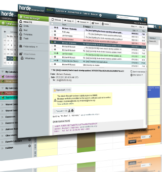

<!--
N.B.: This README was automatically generated by https://github.com/YunoHost/apps/tree/master/tools/README-generator
It shall NOT be edited by hand.
-->

# Horde for YunoHost

[](https://dash.yunohost.org/appci/app/horde)    
[](https://install-app.yunohost.org/?app=horde)

*[Lire ce readme en français.](./README_fr.md)*

> *This package allows you to install Horde quickly and simply on a YunoHost server.
If you don't have YunoHost, please consult [the guide](https://yunohost.org/#/install) to learn how to install it.*

## Overview

A groupware (webmail, adressbook, calendar) witch use PHP


**Shipped version:** 5.2.23~ynh1


**Demo:** http://demo.horde.org

## Screenshots



## Disclaimers / important information

### Customisation

#### Install others app.

The package provide some apps, but it's could be possible to install some others apps. The list of all availabe apps are listed here : https://www.horde.org/apps

Before any change it's recommended to make a backup :
```bash
# In case of multiple instance adapt "horde" by the horde instance
sudo yunohost backup create --verbose --ignore-system --apps horde
```

Install horde apps with pear :

```bash
# Get the horde final_path
# In case of multiple instance adapt "horde" by the horde instance
final_path=$(yunohost app setting horde final_path)

# Set the pear command to call to stay in the horde environnement (not in the global system environnement)
pear_cmd="$final_path/pear/pear -c $final_path/pear.conf"

# Update the pear channel
$pear_cmd channel-update pear.horde.org

# Install the app that you want
$pear_cmd install -a -B horde/APP_TO_INSTALL

# Set the final permission
# In case of multiple instance adapt "horde" by the horde instance
chown -R www-data:horde $final_path

```

After you need to update the horde database schema and the horde config. So go on the horde config pannel (in the settings wheel > Preferences > Administration > Configuration). Click on "Update all DB schemas" and then on "Update all configurations".

Now you should be able to use the new apps.

### ActiveSync

For calendar, task and addressbook activeSync has been configured but not yet tested.

### Troubleshotting

**Get Address is missing domain while to try to send an email.**

- You need to create an identity before send an email.
- To create this go in the settings wheel > Preferences > Global Preferences > Personal Information.
- Complete the form and save it.
- You might be able to sed an email now.

## Documentation and resources

* Official app website: <https://www.horde.org>
* Official admin documentation: <https://wiki.horde.org>
* Upstream app code repository: <https://github.com/horde/base>
* YunoHost documentation for this app: <https://yunohost.org/app_horde>
* Report a bug: <https://github.com/YunoHost-Apps/horde_ynh/issues>

## Developer info

Please send your pull request to the [testing branch](https://github.com/YunoHost-Apps/horde_ynh/tree/testing).

To try the testing branch, please proceed like that.

``` bash
sudo yunohost app install https://github.com/YunoHost-Apps/horde_ynh/tree/testing --debug
or
sudo yunohost app upgrade horde -u https://github.com/YunoHost-Apps/horde_ynh/tree/testing --debug
```

**More info regarding app packaging:** <https://yunohost.org/packaging_apps>
